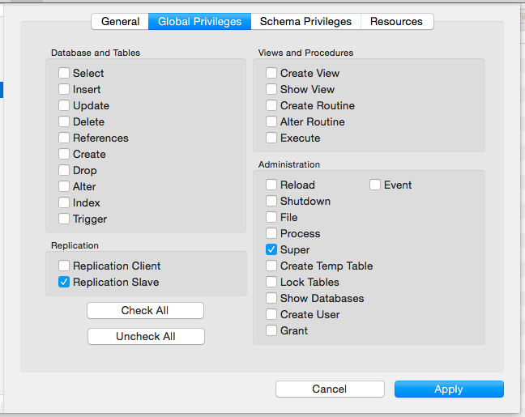

# Using Meteor with MySQL

## Meta

This project uses the [numtel:mysql](https://github.com/numtel/meteor-mysql) package.

## Prerequisites

### MySQL configuration

`/etc/mysql/my.cnf`

must contain the two parameters

    log_bin = mysql-bin
    server_id = 1337

This activates the binary logging and replication features which are needed by the Livequery package.

**Important** Properly configuring the MySQL server to use binary logs and replication is essential for successful database connections with the `numtel:mysql` package!

### Import data

Import the `data.sql` file into a MySQL server.

### User privileges

Users need to have the `Super` and `Replication Slave` (**or** `Replication Client`) privileges:

